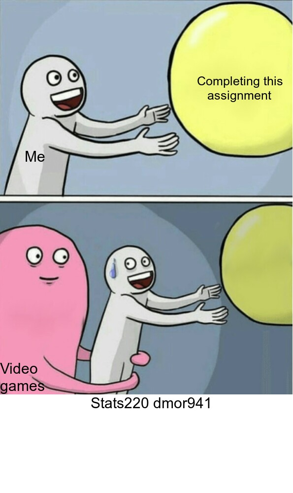

# **How to meme**  
## Where did I look?  

I browsed [meme templates](https://imgflip.com/memetemplates) and thought that this particular template might be easy to work with.
## Motivation for this particular meme  

For a lot of my uni work I find myself putting things off until the last minute or getting distracted and I think this meme encapsulates that quite well. This *definitely* won't happen for the next assignment.  




The R code I used to create this meme is as follows:

```
library(magick)
Me <- c("Me")

balloon <- image_read('https://imgflip.com/s/meme/Running-Away-Balloon.jpg')%>%
image_scale("595")%>%
image_scale("x800")%>%
  image_annotate("Video \ngames", size = 30, gravity = "southwest", color = "black")%>%
  image_annotate(Me, size = 30, location = "+50+300", color = "black")%>%
  image_annotate("Completing this\n   assignment", size = 25, location = "+400+150", color = "black")
stats220 <- image_blank(595, 200, color = "white")%>%
  image_annotate("                       Stats220 dmor941", size = 30)

meme <- c(balloon, stats220)
meme <- image_append(meme, stack = TRUE)
image_write(meme, "my_meme.png")

```
### Things I found easy  
-Deciding on the meme  
-Annotating the image  
### Things I found hard
1. Using image_append as I didn't really need anything else for the meme so I made a bad watermark
2. Swapping between coding languages through multiple CompSci papers is quite hard
